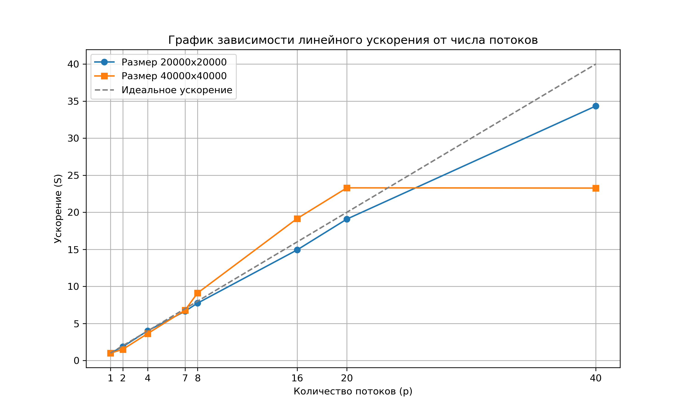

# Лабораторная работа №2. Задание 1.

## Характеристики вычислительного узла

*   **Наименование сервера:** ProLiant XL270d Gen10
*   **Модель CPU:** Intel(R) Xeon(R) Gold 6248 CPU @ 2.50GHz (2 сокета, 20 ядер на сокет, 80 потоков(HT))
*   **NUMA узлы:** 2 узла (Node 0: CPU 0-19, 40-59; Node 1: CPU 20-39, 60-79)
*   **Оперативная память (RAM):**
    *   Node 0: ~376 GB
    *   Node 1: ~377 GB
    *   Итого: ~753 GB
*   **Операционная система:** Ubuntu 22.04.5 LTS

## Анализ масштабируемости

Замеры проводились на массивах размером `20000x20000` и `40000x40000`. Ускорение $S(p)$ вычислялось по формуле: $S(p) = \frac{T_1}{T_p}$, где $T_1$ - время последовательного выполнения (на 1 потоке), а $T_p$ - время выполнения на $p$ потоках.

Согласно заданию, время измеряется **только** для основной вычислительной фазы (без учета времени, затраченного на инициализацию массивов).

| Кол-во потоков | Время ($20000^2$), с | Ускорение $S(p)$ | Время ($40000^2$), с | Ускорение $S(p)$ |
| :---: | :---: | :---: | :---: | :---: |
| 1 | 1.284710 | 1.00 | 6.221484 | 1.00 |
| 2 | 0.685136 | 1.88 | 4.118782 | 1.51 |
| 4 | 0.319801 | 4.02 | 1.706965 | 3.64 |
| 7 | 0.193153 | 6.65 | 0.915792 | 6.79 |
| 8 | 0.165974 | 7.74 | 0.683131 | 9.11 |
| 16 | 0.086106 | 14.92 | 0.324849 | 19.15 |
| 20 | 0.067321 | 19.08 | 0.267043 | 23.30 |
| 40 | 0.037416 | 34.34 | 0.267401 | 23.27 |

### Выводы
1. Для матрицы меньшего размера ($20000 \times 20000$) на большом числе потоков ускорение растет почти линейно (~34.3x на 40 потоках).
2. Для большей матрицы $40000 \times 40000$ ускорение уверенно растет вплоть до 20 потоков, после чего прекращает расти. Это явный признак того, что программа уперлась в **пропускную способность памяти**. 

## Дополнительное задание: Привязка потоков

Для проверки влияния локальности данных и пропускной способности памяти был проведен тест с жесткой привязкой 20 потоков к физическим ядрам первого сокета (NUMA Node 0). Для привязки использовалась утилита `taskset`. 

**Результаты на 20 потоках:**

| Размер матрицы | Без привязки | С привязкой (только Node 0) |
| :---: | :---: | :---: |
| 20000 x 20000 | 0.086056 с | 0.110726 с |
| 40000 x 40000 | 0.290094 с | 0.372787 с |

### Вывод по привязке
При жесткой привязке к ядрам одной NUMA-ноды программа стала работать **медленнее** (примерно на 30%). Это происходит потому, что:
* Когда программа работает **без привязки**, 20 потоков распределяются по ядрам *обоих* нодов процессора. Страницы матрицы также равномерно распределяются между планками памяти, и программа **задействует пропускную способность обеих шин памяти**.