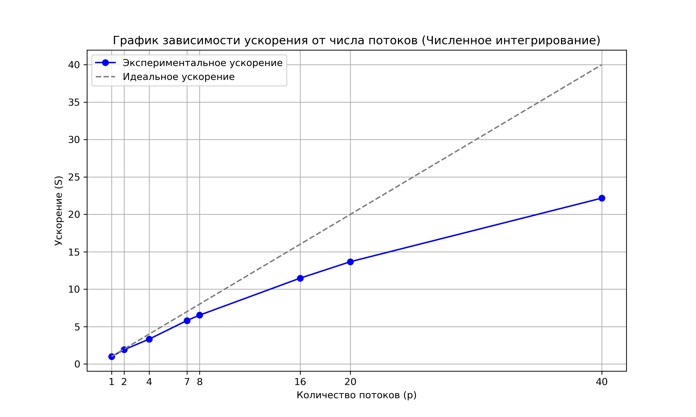
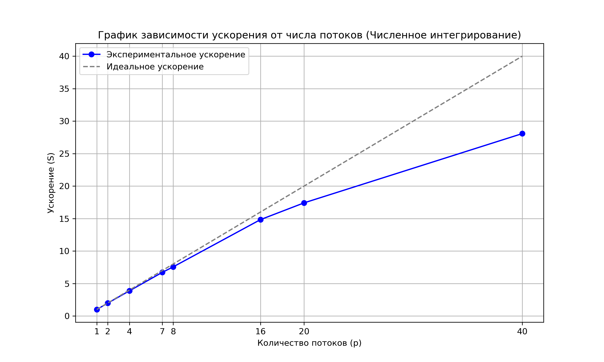

# Лабораторная работа №2. Задание 2.

## Характеристики вычислительного узла

*   **Наименование сервера:** ProLiant XL270d Gen10
*   **Модель CPU:** Intel(R) Xeon(R) Gold 6248 CPU @ 2.50GHz (2 сокета, 20 ядер на сокет, 80 потоков(HT))
*   **NUMA узлы:** 2 узла (Node 0: CPU 0-19, 40-59; Node 1: CPU 20-39, 60-79)
*   **Оперативная память (RAM):**
    *   Node 0: ~376 GB
    *   Node 1: ~377 GB
    *   Итого: ~753 GB
*   **Операционная система:** Ubuntu 22.04.5 LTS

## Анализ масштабируемости

Замеры проводились при количестве точек интегрирования `nsteps = 40 000 000`. Ускорение вычислялось как отношение времени последовательного кода (на 1 потоке) к времени выполнения на $p$ потоках.

| Кол-во потоков | Время, с | Ускорение $S(p)$ | Погрешность (error) |
| :---: | :---: | :---: | :---: |
| 1 | 0.532101 | 1.00 | $2.73 \cdot 10^{-8}$ |
| 2 | 0.277864 | 1.91 | $2.73 \cdot 10^{-8}$ |
| 4 | 0.159849 | 3.32 | $2.73 \cdot 10^{-8}$ |
| 7 | 0.091567 | 5.81 | $2.73 \cdot 10^{-8}$ |
| 8 | 0.081501 | 6.52 | $2.73 \cdot 10^{-8}$ |
| 16 | 0.046389 | 11.47 | $2.73 \cdot 10^{-8}$ |
| 20 | 0.038916 | 13.67 | $2.73 \cdot 10^{-8}$ |
| 40 | 0.024003 | 22.16 | $2.73 \cdot 10^{-8}$ |

### Выводы
1. Увеличение количества потоков никак не повлияло на точность вычисления, значит состоярния гонки при подсчёте общей суммы удалось избежать.
2. В отличие от умножения матрицы на вектор, задача вычисления интеграла не упёрлась в пропускную способность памяти и "плато" на графике нет.
3. Нелинейность роста ускорения с увеличением количества потоков связана с очень маленьким временем исполнения программы - доля накладных расходов и времени подсчёта общей суммы становится достаточно весомой относительно времени рассчёта площадей. При увеличении количества прямоугольников рост ускорения становится практически линейным пока длительность выполнения программы не станет меньше половины секунды:

## Дополнительное задание: Привязка потоков
Был проведен тест с жесткой привязкой 20 потоков к физическим ядрам первого сокета (NUMA Node 0). Для привязки использовалась утилита `taskset`. 

**Результаты на 20 потоках:**

| Режим запуска | Время выполнения, сек |
| :--- | :---: |
| Обычный запуск| `0.038043` |
| Привязка к ядрам 1-го нода | `0.039762` |

### Выводы
В отличие от задачи умножения матрицы на вектор, где привязка к ядрам одного процессора вызывала падение пропускной способности памяти и значительное замедление выполнения программы, в данном случае время работы практически не изменилось и находится в пределах погрешности. 