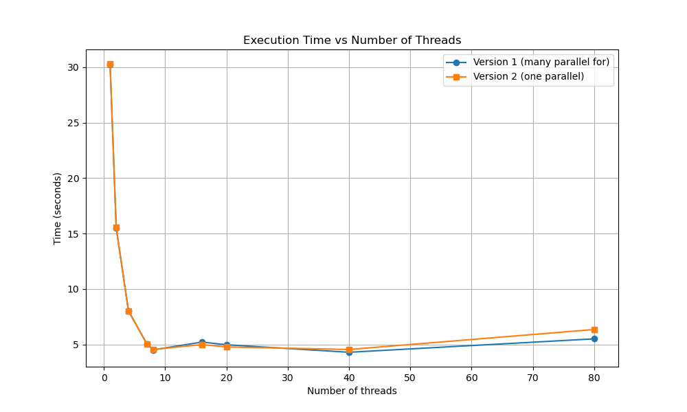
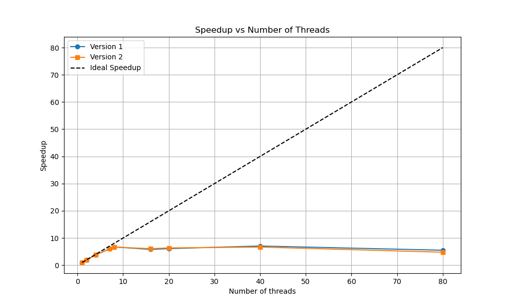
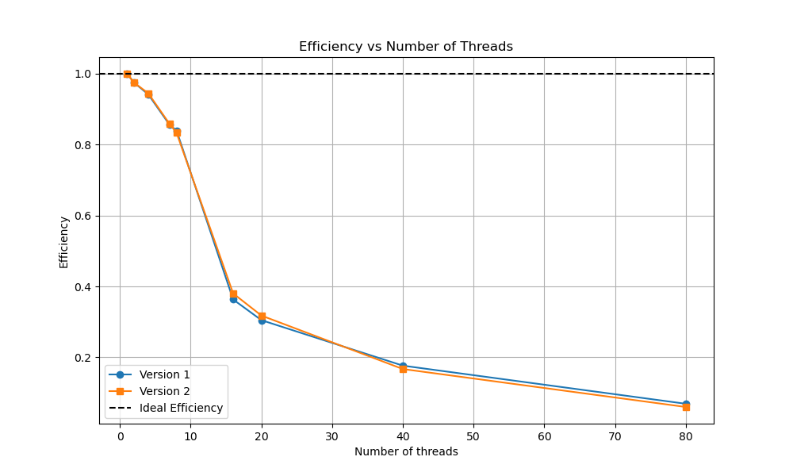

# Лабораторная работа №2. Задание 3.

## Описание задачи

В данном задании реализован **метод простой итерации** для решения системы линейных алгебраических уравнений (СЛАУ) вида $Ax = b$.

Было реализовано два варианта распараллеливания алгоритма:
1. **Вариант 1:** Использование `#pragma omp parallel for` на каждый ресурсоёмкий цикл в алгоритме.
2. **Вариант 2:** Создание единой параллельной секции `#pragma omp parallel` вокруг всего алгоритма.

## Характеристики вычислительного узла

*   **Наименование сервера:** ProLiant XL270d Gen10
*   **Модель CPU:** Intel(R) Xeon(R) Gold 6248 CPU @ 2.50GHz (2 сокета, 20 ядер на сокет, 80 потоков(HT))
*   **NUMA узлы:** 2 узла (Node 0: CPU 0-19, 40-59; Node 1: CPU 20-39, 60-79)
*   **Оперативная память (RAM):**
    *   Node 0: ~376 GB
    *   Node 1: ~377 GB
    *   Итого: ~753 GB
*   **Операционная система:** Ubuntu 22.04.5 LTS

## Анализ масштабируемости

Замеры проводились на матрице размером $1050 \times 1050$. Время измерялось **только** для вычислительной фазы (без учета инициализации).

| Кол-во потоков | Время Вариант 1, с | Время Вариант 2, с | Ускорение $S(p)$ V1 | Ускорение $S(p)$ V2 |
|----------------|--------------------|--------------------|---------------------|---------------------|
| 1              | 31.8027            | 30.4547            | 1.00                | 1.00                |
| 2              | 16.3627            | 15.6739            | 1.94                | 1.94                |
| 4              | 8.5013             | 8.1705             | 3.74                | 3.72                |
| 7              | 5.1500             | 4.9496             | 6.17                | 6.15                |
| 8              | 4.6923             | 4.5154             | 6.78                | 6.74                |
| 16             | 6.0040             | 5.9420             | 5.29                | 5.12                |
| 20             | 6.5562             | 6.4075             | 4.85                | 4.75                |
| 40             | 6.9362             | 8.3508             | 4.58                | 3.64                |
| 80             | 5.8425             | 5.8397             | 5.44                | 5.21                |

### Способы распределения итераций (schedule)
Для выявления оптимального способа распределения итераций между потоками было проведено исследование директивы `schedule(type, chunk_size)` при фиксированном количестве потоков ($p=8$) и размере матрицы $N=1050$.

| Schedule type | Chunk Size | Время Вариант 1, с | Время Вариант 2, с |
|---------------|------------|--------------------|--------------------|
| **static**    | default    | 4.58               | 5.07               |
| **static**    | 1          | 4.64               | 4.76               |
| **static**    | 10         | 5.10               | 5.51               |
| **static**    | 100        | 7.21               | 6.13               |
| **static**    | 500        | 9.39               | 10.57              |
| **dynamic**   | 1          | 4.18               | 4.57               |
| **dynamic**   | 10         | 4.12               | **4.30**               |
| **dynamic**   | 100        | 5.17               | 5.12               |
| **dynamic**   | 500        | 12.37              | 12.14              |
| **guided**    | 1          | **3.69**           | 4.72           |
| **guided**    | 10         | 4.48               | 4.72               |
| **guided**    | 100        | 5.37               | 5.32               |
| **guided**    | 500        | 12.27              | 12.28              |

Увеличение chunk_size до 100 и 500 приводит к резкой деградации производительности во всех режимах. Это связано с неравномерной загрузкой (поскольку матрица имеет размер $1050 \times 1050$, размер порции в 500 строк означает, что некоторым потокам может достаться слишком мало работы или вообще не достаться).

Наилучший результат показало динамическое сбалансированное распределение: **`guided` с `chunk_size = 1`** (3.69 с для Варианта 1) и **`dynamic` с `chunk_size = 10`** (4.12 с). Объясняется это тем, что операционная система может непредсказуемо прерывать потоки (вытесняющая многозадачность). При жестко заданном `static`, если один поток "застрял", все остальные его ждут на барьере. Конструкции `dynamic` и `guided` позволяют более быстрым потокам забирать оставшуюся работу у медленных. `guided` работает лучше всего, так как начинает с больших порций (минимизируя накладные расходы на диспетчеризацию) и уменьшает их к концу цикла (предотвращая дисбаланс на финише).

### Выводы
Исходя из графиков, таблицы ускорения и исследования способов планирования, можно сделать следующие выводы:

1. **Ограничение пропускной способности памяти (Memory-bound):**
   Ядро алгоритма — умножение матрицы на вектор ($O(N^2)$ вычислений на $O(N^2)$ обращений к памяти). При 8 потоках полностью утилизируется пропускная способность каналов памяти сокета (Memory Wall). Дальнейшее добавление ядер приводит к простаиванию CPU в ожидании данных.
   
2. **Влияние NUMA и издержки синхронизации:**
   На 40 и более потоках подключается второй процессор (Node 1). Если потоки работают с памятью на другом узле, то происходит задержка из-за межсокетной шины (UPI). 

3. **Сравнение Варианта 1 (Fine-Grained) и Варианта 2 (Coarse-Grained):**
   Логически Вариант 2 эффективнее, так как избавляет от частого порождения/разрушения пула потоков (Fork-Join). Однако на практике (и особенно на 40+ потоках), Вариант 2 уступает первой версии (8.35с против 6.93с). В Варианте 2 накопление локальной нормы в общую переменную требует жесткой ручной синхронизации с помощью директив `#pragma omp atomic` и `#pragma omp barrier`. При распределении нагрузки по 40 потокам, конкурирующим за атомарный инкремент, это приводит к существенному аппаратному конфликту за блокировку кэш-линий (Lock Contention). Вариант 1, использующий стандартную клаузу редукции `reduction(+)`, аппаратно оптимизируется компилятором (через древовидное сложение или локальные буферы), что работает значительно быстрее ручных блокировок.

**Итоговый вывод о целесообразности:**
Для данного класса задач (интенсивная работа с памятью и использование редукции) применение **Первого варианта** программы является более целесообразным. Комбинация `#pragma omp parallel for reduction(+)` с `schedule(guided, 1)` обеспечивает наилучшую из возможных производительность, безопасную масштабируемость на NUMA-системах и защищает от конфликта блокировок при задействовании большого числа физических ядер. Использование единой параллельной секции (Вариант 2) оправданно только в задачах, не требующих частых глобальных синхронизаций состояния и редукций общего результата.