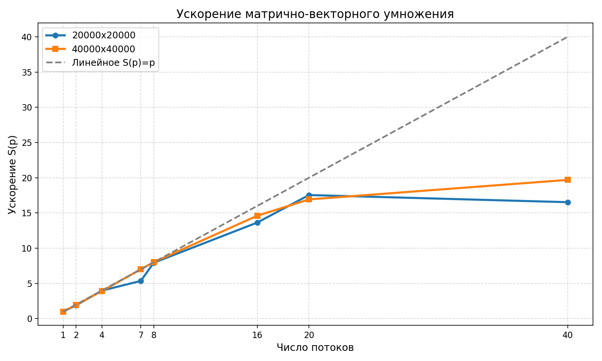
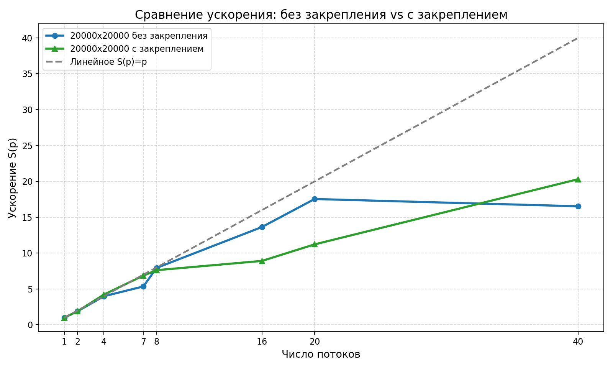

# Лабораторная работа №3. Задание 1

## Цель работы

Исследовать масштабируемость многопоточного умножения матрицы на вектор на `std::thread` и оценить влияние закрепления потоков на производительность.

## Методика измерений

Ускорение считалось по формуле:

$$
S(p) = \frac{T_1}{T_p},
$$

где $T_1$ — время вычислительной фазы на 1 потоке, а $T_p$ — время вычислительной фазы на $p$ потоках.

Согласно заданию, время измеряется **только** для основной вычислительной фазы (без учета времени, затраченного на инициализацию массивов).

## Основное задание

### Результаты для матрицы 20000x20000

| Кол-во потоков | Время вычисления, с | Ускорение S(p) |
| :---: | :---: | :---: |
| 1 | 1.221274 | 1.000 |
| 2 | 0.646584 | 1.889 |
| 4 | 0.306653 | 3.983 |
| 7 | 0.228191 | 5.352 |
| 8 | 0.153956 | 7.933 |
| 16 | 0.089559 | 13.637 |
| 20 | 0.069623 | 17.541 |
| 40 | 0.073889 | 16.528 |

### Результаты для матрицы 40000x40000

| Кол-во потоков | Время вычисления, с | Ускорение S(p) |
| :---: | :---: | :---: |
| 1 | 5.034208 | 1.000 |
| 2 | 2.568334 | 1.960 |
| 4 | 1.284437 | 3.919 |
| 7 | 0.718840 | 7.005 |
| 8 | 0.627904 | 8.019 |
| 16 | 0.344710 | 14.604 |
| 20 | 0.297461 | 16.924 |
| 40 | 0.255635 | 19.693 |

### График ускорения

### Анализ результатов основного задания

1. Для матрицы 20000x20000 ускорение растет почти линейно до 20 потоков, после чего на 40 потоках появляется небольшой спад. Это похоже на достижение стены памяти и рост накладных расходов на многопоточность.
2. Для матрицы 40000x40000 ускорение растет во всём диапазоне до 40 потоков, но чуть менее линейно. То есть задача всё ещё выигрывает от распараллеливания, но эффект ускорения постепенно ослабевает.
3. По данным можно сделать вывод что обе матрицы достигают memory wall в одной точке, но вероятно это не так и на малой матрице просто большую роль начинают играть накладные расходы за счёт более короткого общего времени подсчёта.

## Дополнительное задание: Сравнение с закреплением потоков

Для матрицы 20000x20000 отдельно сравнивались режимы с закреплением потоков и без него.

### Результаты для матрицы 20000x20000 (с закреплением потоков)

| Кол-во потоков | Время вычисления, с | Ускорение S(p) |
| :---: | :---: | :---: |
| 1 | 1.234209 | 1.000 |
| 2 | 0.654540 | 1.885 |
| 4 | 0.292870 | 4.214 |
| 7 | 0.179817 | 6.865 |
| 8 | 0.162010 | 7.618 |
| 16 | 0.138518 | 8.910 |
| 20 | 0.110020 | 11.218 |
| 40 | 0.060793 | 20.302 |

### График дополнительного задания

### Анализ дополнительного задания

1. Закрепление потоков не даёт монотонного выигрыша. На части точек оно ускоряет вычисление, а на части — замедляет.
2. На 7 и 40 потоках закрепление оказалось лучше, что согласуется с уменьшением миграций потоков и более предсказуемой локальностью данных.
3. На 8, 16 и 20 потоках закрепление проигрывает, значит affinity полезна не всегда и зависит от конфигурации потоков и поведения подсистемы памяти.

## Итоговые выводы

1. Реализация на `std::thread` корректно масштабируется, но на меньшей матрице насыщение наступает раньше, чем на большей.
2. Для матрицы 40000x40000 эффект распараллеливания сохраняется до 40 потоков, но прирост после 20 потоков становится менее выраженным.
3. Закрепление потоков не является универсальным улучшением: в этой задаче оно улучшает одни точки и ухудшает другие.