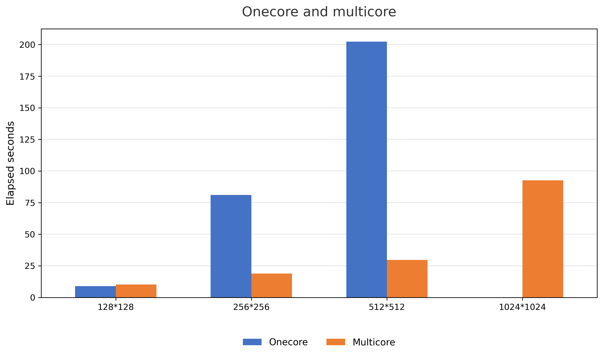
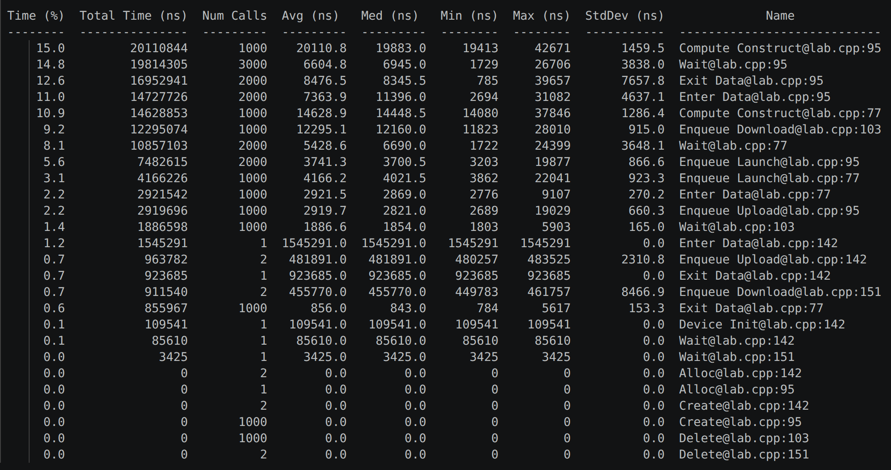
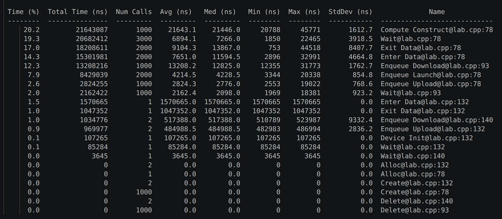
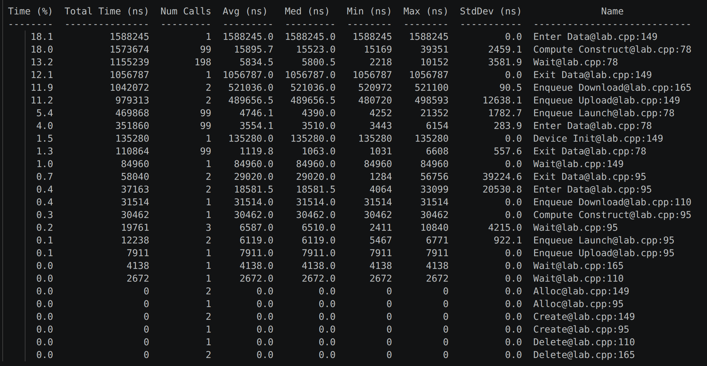
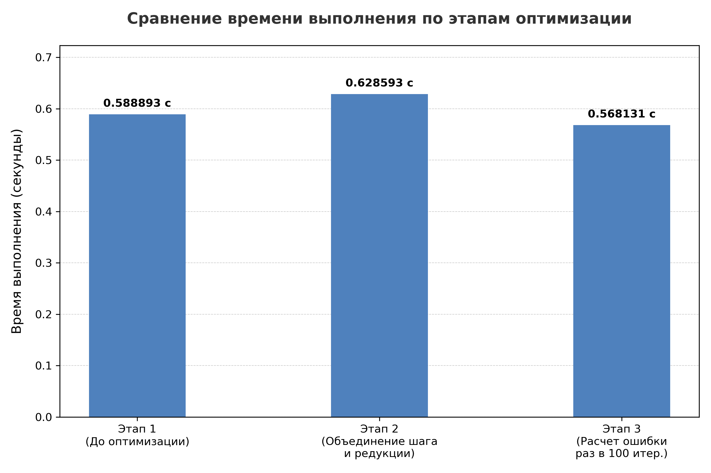
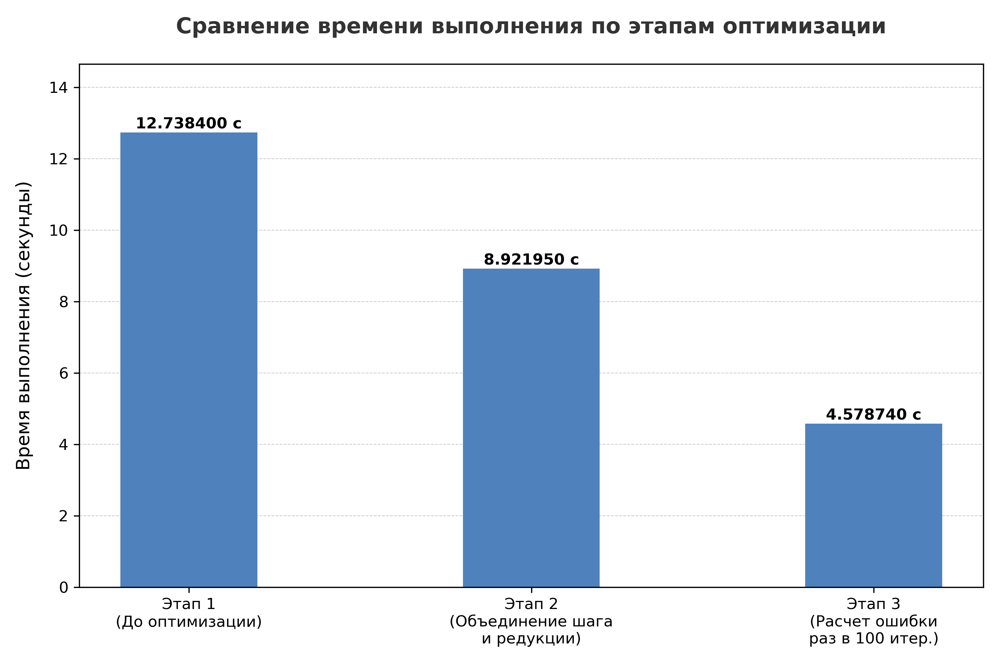
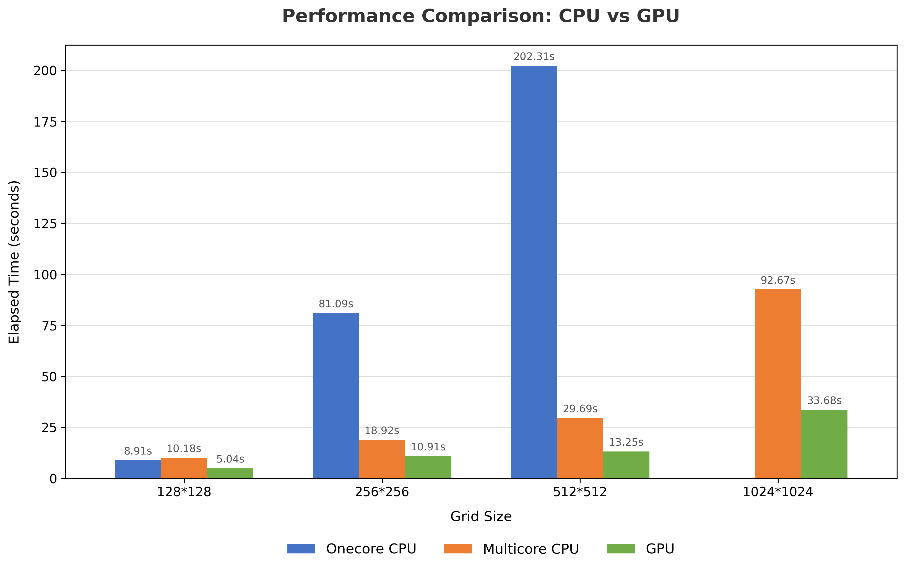

## Цель работы

Исследовать производительность реализации на CPU и GPU, выполнить профилирование Nsight Systems, затем применить и оценить оптимизацию GPU-варианта.

### Используемый компилятор

`pgc++ (aka nvc++) 23.11-0`

### Используемый профилировщик

`NVIDIA Nsight Systems version 2023.3.1.92-233133147223v0`

## Выполнение на CPU

### CPU-onecore

| Размер сетки | Время выполнения | Точность | Количество итераций |
| --- | ---: | ---: | ---: |
| 128*128 | 8.906091 | 9.99992e-07 | 488908 |
| 256*256 | 81.090056 | 4.7288e-06 | 1000000 |
| 512*512 | 202.309074 | 1.06218e-05 | 1000000 |

### CPU-multicore

| Размер сетки | Время выполнения | Точность | Количество итераций |
| --- | ---: | ---: | ---: |
| 128*128 | 10.177737 | 9.99992e-07 | 488908 |
| 256*256 | 18.918469 | 4.7288e-06 | 1000000 |
| 512*512 | 29.690068 | 1.06218e-05 | 1000000 |
| 1024*1024 | 92.669359 | 1.00154e-05 | 1000000 |

### Диаграмма сравнения время работы CPU-one и CPU-multi

## Выполнение на GPU

### Этапы оптимизации на сетке 512*512

| Этап № | Время выполнения | Точность | Максимальное количество итераций | Комментарии |
| --- | ---: | ---: | ---: | --- |
| 1 | 0.588893 | 0.0935758 | 100 | До оптимизации |
| 2 | 0.628593 | 0.0935758 | 100 | Объединён шаг вычисления и редукция ошибки |
| 3 | 0.568131 | 0.0935758 | 100 | Подсчёт ошибки один раз в 100 итераций |

#### Этап 1

#### Этап 2

#### Этап 3

### Диаграмма оптимизации

**При тестировании на матрице размером 1024x1024 при максимуме в 100000 итераций результаты становятся более явными:**

| Этап № | Время выполнения | Точность | Максимальное количество итераций | Комментарии |
| --- | ---: | ---: | ---: | --- |
| 1 | 12.7384 | 0.0935758 | 100000 | До оптимизации |
| 2 | 8.92195 | 0.0935758 | 100000 | Объединён шаг вычисления и редукция ошибки |
| 3 | 4.57874 | 0.0935758 | 100000 | Подсчёт ошибки один раз в 100 итераций |

### GPU – оптимизированный вариант

| Размер сетки | Время выполнения | Точность | Количество итераций |
| --- | ---: | ---: | ---: |
| 128*128 | 5.038517 | 9.98867e-07 | 489000 |
| 256*256 | 10.912454 | 4.7288e-06 | 1000000 |
| 512*512 | 13.249931 | 1.06218e-05 | 1000000 |
| 1024*1024 | 33.677205 | 1.00154e-05 | 1000000 |

### Диаграмма сравнения времени работы CPU-one, CPU-multi, GPU(оптимизированный вариант) для разных размеров сеток

## Вывод

 - На малых сетках выигрыш от использования GPU практически незаметен или нивелируется накладными расходами на инициализацию контекста ускорителя, но на больших сетках использование GPU даёт колоссальный прирост

 - Основными ограничителями производительности являлись избыточные задержки на синхронизацию (Wait занимал 14.8% времени) и частые операции работы с данными (Exit Data — 12.6%, Enter Data — 11.0%, Enqueue Download — 9.2%). Программа тратила слишком много ресурсов на постоянное управление вычислительными конструктами и пересылку данных между хостом и девайсом.

 - Слияние вычислительного шага и редукции ошибки в единый блок OpenACC позволило сократить накладные расходы на запуск ядер. Время работы снизилось с 12.74 с до 8.92 с. Однако, операции ожидания (Wait — 19.3%) и выхода/входа данных всё еще оставались критически высокими.

 - Было принято решение вычислять и проверять критерий остановки не каждую итерацию, а один раз в 100 итераций. Количество вызовов тяжелых функций синхронизации и скачивания упало ровно в 100 раз (с 1000 до 99 и с 2000 до 198). Время выполнения на тесте упало до 4.58 с (суммарное ускорение GPU-версии в ~2.8 раза относительно базового варианта).

